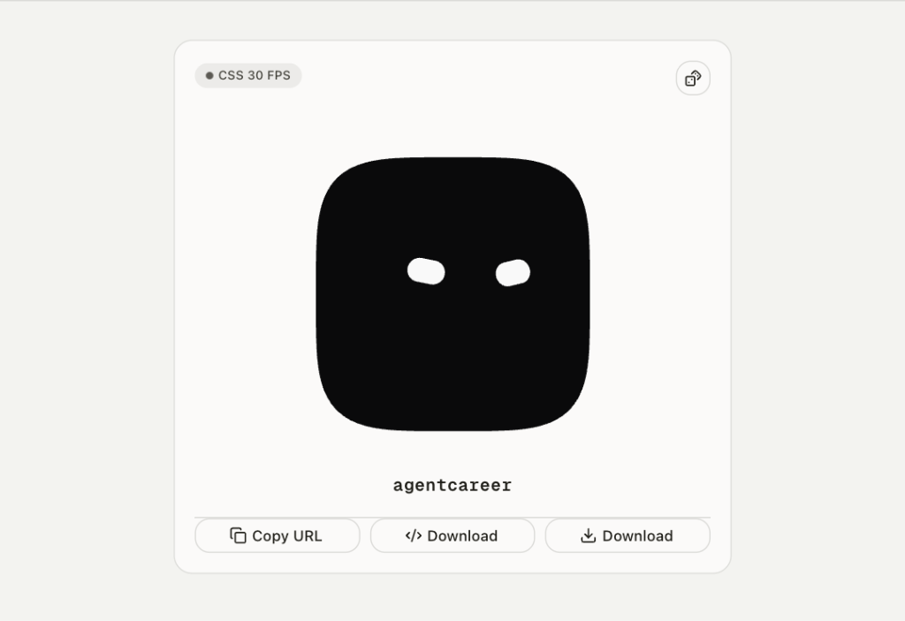

# AgentCareer Avatars



A beautiful, open-source avatar generator built with Next.js 16, React 19, and Tailwind CSS v4.

## Features

- **Customizable Avatars**: Change shapes, colors, facial expressions, and more.
- **Export Options**: Download as animated or static SVG, or copy a URL that renders the avatar dynamically.
- **Modern Stack**: Built using Next.js Turbopack, Tailwind CSS v4, and Shadcn UI.
- **Zero Config Linting**: Setup with Ultracite & Oxlint for extreme code quality and performance.

## Getting Started

1. **Install dependencies:**
   ```bash
   bun install
   ```

2. **Run the development server:**
   ```bash
   bun run dev
   ```

3. **Open the app:**
   Navigate to [http://localhost:3000](http://localhost:3000) in your browser to see the result.

## API Usage

You can generate avatars dynamically by passing query parameters to the API endpoint:

```
/api/avatar.svg?seed=agentcareer&animated=true&paper=transparent
```

## Star History

<a href="https://star-history.com/#dzulhelmynazri/agentcareer-avatars&Date">
 <picture>
   <source media="(prefers-color-scheme: dark)" srcset="https://api.star-history.com/svg?repos=dzulhelmynazri/agentcareer-avatars&type=Date&theme=dark" />
   <source media="(prefers-color-scheme: light)" srcset="https://api.star-history.com/svg?repos=dzulhelmynazri/agentcareer-avatars&type=Date" />
   
 </picture>
</a>

## Contributing

Contributions are welcome! Please feel free to submit a pull request.

## License

MIT
